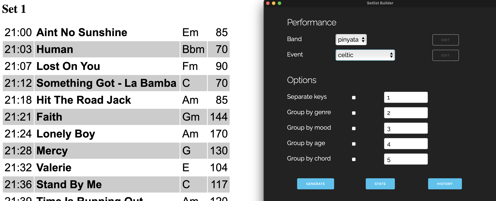

# Setlist Generator

This project is targeted at musicians, who want to generate the best setlist possible.

Basically; you provide your song pool and set flow in JSON format, and the program automatically generates the best 
sequence of songs. 

## How To Use

- Edit config/constants.py and put your own values here
- Create and put your JSON files into the /data folder. The file should look like the samples provided in /data. The format is very intuitive.
- Run main.py

## Igigi integration

Igigi is a mobile gig helper app, available at https://github.com/keremkoseoglu/igigi . 

When you generate an HTML output, it will also generate an output for Igigi which can later be downloaded to Igigi (iPad) over Dropbox.

## How To Extend

If you want to add new song properties;
- Extend your JSON file(s) with new properties
- Edit gig/song.py to support the new properties
- Edit generator/primal_song_picker.py (or your own generators) to consider the new properties

If you want to modify the default generator, you can edit /generator/primal_song_picker.py with your own logic

If you want to develop a new generator;
- Create a new file + class under /generator, which extends /generator/abstract_generator
- Ensure that /gui/prime.py uses your new generator instead of the default one

If you need a new writer (like a new file format output);
- Create a new file + class under /writer, which extends /writer/abstract_writer
